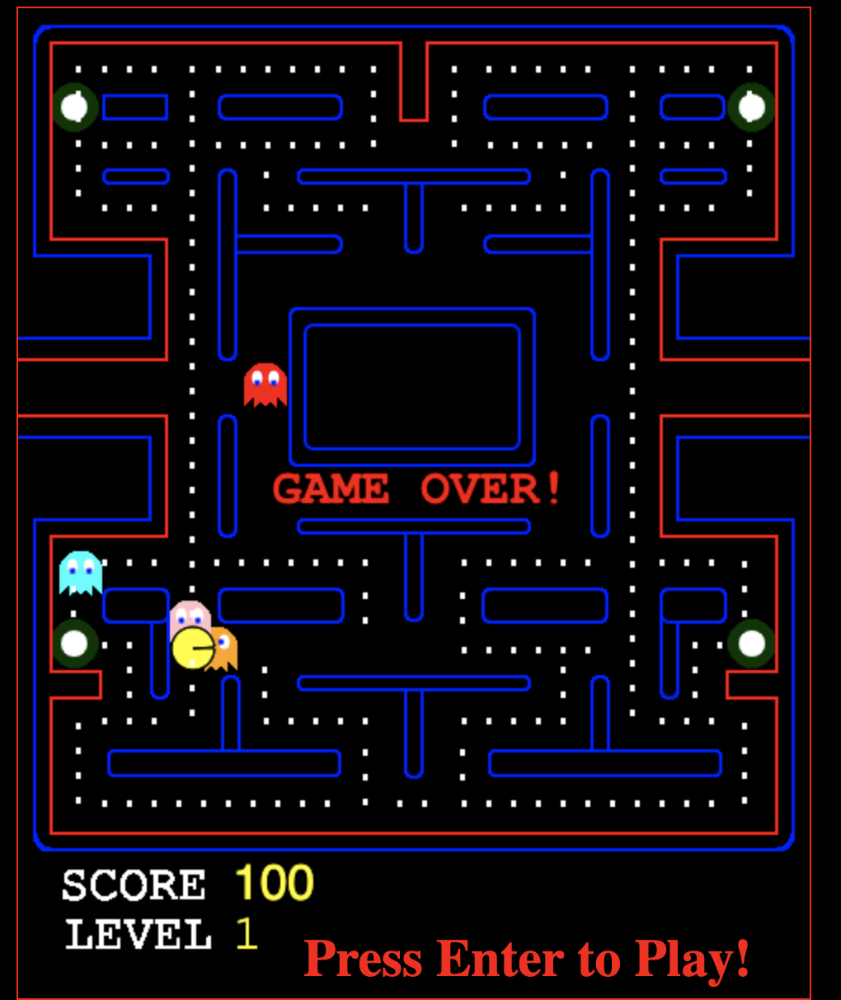

This code was just an exercise for me just to keep my coding skill up to date. The game runs smoothly and it is engaging. I used only Chrome so it does not work outside that browser at all.

Docker: https://hub.docker.com/r/manologutierrez/nginx-pacman

Demo: http://pac-man.michelada.io

video: https://www.youtube.com/watch?v=u5lsx0y-QSU&feature=youtu.be&fbclid=IwAR0VXWFy7HJE9jBxtoCOfeWqk-ykzhKNSG2RMJvYvnmeAuQtLXkTEV9i9LI

Im Planning to use the game to train a Neural Network that im working on.

Run the code through nginx as a web server, otherwise it will not work the reason is that the game does some ajax calls. Hope you like it :)

##Install using npm

```sh
npm instal pac-man-game 
```

###Run it
```sh
cd pac-man-game && npm start 
```



